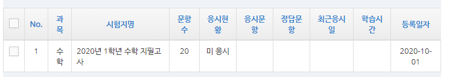

# benedu-nodejs
Do Something Fun🤣, Based on Benedu2020

# How to use
**Recomment to store credential with dotenv**
```typescript
import getUserToken from './auth/getUserToken'
import getTaskExamList from './exam/getTaskExamList'
(async () => {
  await getUserToken('username', 'password')
  console.log(await getTaskExamList()) // Print 과제
})()
```

# Functions
## 과제 불러오기
```typescript
import getTaskExamList from './exam/getTaskExamList'
getTaskExamList().then(console.log)
```
```
[
  {
    subject: '영어',
    register: 'MASKED',
    examTitle: '2020년 9월  29일 화요일 1학년 영어 일일학습',
    questionQuantity: 6,
    solvedQuantity: 1,
    state: '응시중',
    endedAt: 2020-10-04T14:59:00.000Z,
    startedAt: 2020-09-28T15:00:00.000Z,
    examId: 'r660uc9In9GxtDVV8qPJmg{e}{e}'
  }...
]
```

## 등록된 문제은행 불러오기
```typescript
import getCreatedExam from './exam/getCreatedExam'
getCreatedExam().then(console.log)
```
```
[
  {
    subject: '수학',
    examTitle: '(2020-09-30 09:29) 베네듀학습 - 수학 [수의 이해]',
    questionQuantity: 2,
    startedAt: 2020-09-30T00:00:00.000Z,
    examId: 'eMP7iqA7m5nkqmwDA8tVNw{e}{e}'
  }...
]
```

## 이전 지필고사 정보 불러오기
```typescript
import fromRegularExam from './exam/getSource/fromRegularExam'
fromRegularExam('국어', '1학년', '2019년').then(console.log)
```
```
[
  RegularExamSource {
    title: '2020년 4월 디미고 모의고사 지필고사 (1학년)',
    subject: '수학',
    grade: '1학년',
    sourceId: 'XeCsqs{s}RWR9llJcUgH{s}Tww{e}{e}',
    year: '2020년'
  } ...
]
```

## 지필고사에서 문제은행 등록하기
```typescript
import getUserToken from './auth/getUserToken'
import getBeforeRegularExam from './exam/getSource/fromRegularExam'

(async () => {
  const regularExams = await getBeforeRegularExam('수학', '1학년', '2019년')
  console.log(await regularExams[0].register('2020년 1학년 수학 지필고사'))
})()
```
```
{
  examId: '7ZCa40{p}9IMR5Otll{p}zgONA{e}{e}',
  examTitle: '2020년 1학년 수학 지필고사',
  questionQuantity: 20
}
```

# Contributor
[RyCont](https://github.com/rycont)

# To-Do
- [ ] Create new exam
- [ ] Benedu2020 Coverage 100%
- [ ] Deno Port
